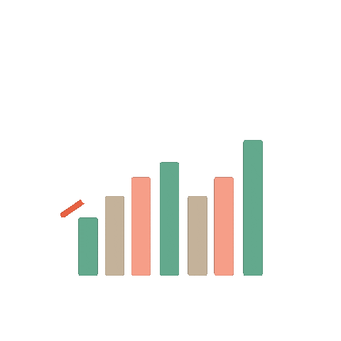

<!--Header Image --->

<!--Welcome Prompt --->
<!----->

<h1 align="center">
    
</h1>

<!--Github Trophies--->

### Github Trophies 

    

<!--About Me Section--->

### About Me 🚀

I am Atharva from Maharashtra,India. An energetic and detail-oriented Computer Engineering student on a journey to bridge the digital realm.
Currently seeking opportunities to learn and grow. Fueled with continuous learning and hardwork aiming to be great at this field.

<!--Current Status--->

### Working On ⚡️
    
- Tweaking This [Readme file 🔎](https://github.com/Atharvkote/Atharvkote.git) For Optimal Engagement
- [Project 💡](https://github.com/Atharvkote/Online-Market-Place.git) : Online Inventory Management System for Local Businesses
- Learning [Pandas](https://github.com/Atharvkote/Pandas) 🐼

<!--Competetive Coding Platforms--->

###  Find Me On [Leetcode](https://leetcode.com/u/AtharvaKote81) 📡
Check out my LeetCode profile to see my solved problems, submissions, and rankings! Ready to tackle more challenges and improve further.

<!--  Tech Stack  --->
<!----Gif Available in Assests--->
    
<h2 align="center">  My Tech Stack  </h2>

Here Are My Few Technical Assests Languages, Libraries I know,Tools I use and My Socials. Make Sure you Follow me on Socials So we can Connect and Build a Better Network 🤝💭

<h3>Languages 💡</h3>

  

### Libraries 📚

<!---
### Tools 🛠 
  
  

-->
  
### Competitive Coding Platforms

    
   <!--   --->

<!-- 
### OS 🖥
  
  
 
-->

### Connect With Me 📪
  
 
   
    
     
    

<!--Github Profile Stats--->
    
<h2 align="center"> My GitHub Stats </h2>
 

  
     
     
  
   
     
   
    
    
<!--Contributuins Graph--->

<h2 align="center"> My GitHub Commits </h2>

<!----Profile Views--->
         
<h2 align="center">
 Still Counting </h2>

  

  <a href="https://github.com/Atharvkote?tab=repositories&sort=stargazers">
    
  

<!---snake gif Available in Assests-->
 

<!----footer animations---->

<h3 align="center">
    
</h3>

