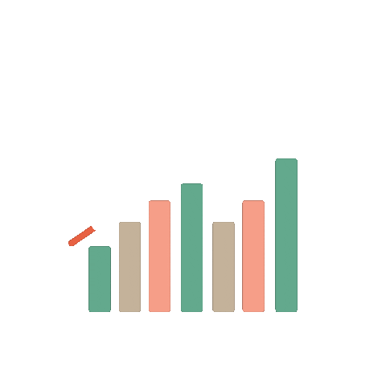

<!--Header Image --->

<!--Welcome Prompt --->
<!----->

<!--Github Trophies--->

<!--About Me Section--->
### About Me 🚀

I am Atharva from Maharashtra,India. An energetic and detail-oriented Computer Engineering student on a journey to bridge the digital realm.
Currently seeking opportunities to learn and grow. Fueled with continuous learning and hardwork aiming to be great at this field.

<!--- Current Status --->

### Working On ⚡️
    
- Tweaking This [Readme file 🔎](https://github.com/Atharvkote/Atharvkote.git) For Optimal Engagement
- [Project 💡](https://github.com/Atharvkote/Online-Market-Place.git) : Online Inventory Management System for Local Businesses
- Learning [Pandas](https://github.com/Atharvkote/Pandas) 🐼

### Achievements 
Here are my Achievements on Coding Platforms 
<!--- Github Trophies --->

### Github Trophies   

<!--Competetive Coding --->

### HackerRank Badges 

###  Find Me On [Leetcode](https://leetcode.com/u/AtharvaKote81) 📡
Check out my LeetCode profile to see my solved problems, submissions, and rankings! Ready to tackle more challenges and improve further.

<!--  Tech Stack  --->
<!----Gif Available in Assests--->
    
<h2 align="center">  My Tech Stack  </h2>

Here Are My Few Technical Assests Languages, Libraries I know,Tools I use and My Socials. Make Sure you Follow me on Socials So we can Connect and Build a Better Network 🤝💭

<h2> Languages 💡 & Tools 🛠 </h2>
<table >
  <tr>
    <td align="center" width="90">
      
       Java
    </td>
    <td align="center" width="90">
      
       Python
    </td>
    <td align="center" width="90">
      
       Javascript
    </td>
    <td align="center" width="90">
      
       HTML5
    </td>
    <td align="center" width="90">
      
       CSS
    </td>
  </tr>
  <tr>
    <td align="center" width="90">
      
       C
    </td>
    <td align="center" width="90">
      
       Numpy
    </td>
    <td align="center" width="90">
      
       Pandas
    </td>
    <td align="center" width="90">
      
       Spyder
    </td>
    <td align="center" width="90">
      
       Jupyter
    </td>
  </tr>
  <tr>
    <td align="center" width="90">
      
       IntelliJ
    </td>
    <td align="center" width="90">
      
       Git
    </td>
    <td align="center" width="90">
      
       GitHub
    </td>
    <td align="center" width="90">
      
       Linux
    </td>
    <td align="center" width="90">
      
       Ubuntu
    </td>
  </tr>
</table>
<!---
### Tools 🛠 
  
  

-->
  
### Competitive Coding Platforms

<table>
  <tr>
    <td align="center" width="90">
      
       LeetCode
    </td>
    <td align="center" width="90">
      
       HackerRank
    </td>
    <td align="center" width="90">
      
       GeeksForGeeks
    </td>
  </tr>
</table>

<!-- 
### OS 🖥
  
  
 
-->

### Connect With Me 📪

<table>
  <tr>
    <td align="center" width="90">
      
       LinkedIn
    </td>
    <td align="center" width="90">
      
       Twitter
    </td>
    <td align="center" width="90">
      
       Stack Overflow
    </td>
    <td align="center" width="90">
      
       Instagram
    </td>
    <td align="center" width="90">
      
       Gmail
    </td>
  </tr>
</table>

<!--Github Profile Stats--->
    
<h2 align="center"> My GitHub Stats </h2>
 

  
     
     
  
   
     
    

<!--Contributuins Graph--->

<!--<h2 align="center"> My GitHub Commits </h2>-->
 

<!----Profile Views--->
         
<h2 align="center">
 Still Counting </h2>

  

  <a href="https://github.com/Atharvkote?tab=repositories&sort=stargazers">
    
  

<!---snake gif Available in Assests-->
 

<!----footer animations---->

